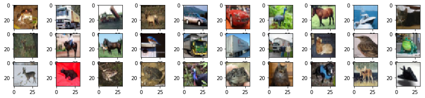

# keras-imprinting
论文Low-Shot Learning with Imprinted Weights 的keras 版简要实现;

该论文也是对于分类网络增量学习的一个典型思想; 一般情况下深度神经网络只能对训练过的类别进行正确分类，如果增加了一个新的类别；就需要从新从头开始训练网络，这是非常耗时的。此论文为分类网络提出一个通用的增量学习新的类别的方法；通过使用新类embedding特征初始化新类的权重方式，可以实习增量零训练，就可以预测新的类别；如果效果不好，可以做完权重imprint后再精调网络。 

# 工程测试

​     测试过程详见：[cifar10例子.ipynb](cifar10%E4%BE%8B%E5%AD%90.ipynb)

##依赖环境
python 3.6
tensorflow-1.9.0
Keras-2.2.0

## 初始化
   设置gpu显存动态分配


```python
from __future__ import print_function
import keras
from keras.datasets import cifar10
from keras.preprocessing.image import ImageDataGenerator
from keras.models import Sequential
from keras.layers import Dense, Dropout, Activation, Flatten
from keras.layers import Conv2D, MaxPooling2D
import os
import numpy as np

def set_gpu_growth():
    os.environ["CUDA_VISIBLE_DEVICES"] = "0"
    cfg = tf.ConfigProto()
    cfg.gpu_options.allow_growth = True
    session = tf.Session(config=cfg)
    K.set_session(session)


```

    Using TensorFlow backend.
    /root/anaconda3/envs/keras/lib/python3.6/importlib/_bootstrap.py:219: RuntimeWarning: numpy.dtype size changed, may indicate binary incompatibility. Expected 96, got 88
      return f(*args, **kwds)
    /root/anaconda3/envs/keras/lib/python3.6/importlib/_bootstrap.py:219: RuntimeWarning: numpy.dtype size changed, may indicate binary incompatibility. Expected 96, got 88
      return f(*args, **kwds)


## 加载cifar数据集


   该数据集共有60000张彩色图像，这些图像是32*32，分为10个类，每类6000张图。这里面有50000张用于训练，构成了5个训练批，每一批10000张图；另外10000用于测试，单独构成一批。测试批的数据里，取自10类中的每一类，每一类随机取1000张。抽剩下的就随机排列组成了训练批。注意一个训练批中的各类图像并不一定数量相同，总的来看训练批，每一类都有5000张图。


```python
# The data, split between train and test sets:
(x_train, y_train), (x_test, y_test) = cifar10.load_data()
print('x_train shape:', x_train.shape)
print(x_train.shape[0], 'train samples')
print(x_test.shape[0], 'test samples')


x_train = x_train.astype('float32')
x_test = x_test.astype('float32')
x_train /= 255
x_test /= 255
```

    x_train shape: (50000, 32, 32, 3)
    50000 train samples
    10000 test samples


### 样例数据展示


```python
import matplotlib.pyplot as plt

def img_show(rows,cols):
    plt.figure(figsize=(cols*1.5,rows))
    for i,img in enumerate(x_train[:rows*cols]):
        plt.subplot(rows,cols,1+i)
        plt.imshow(img)
    plt.show()

img_show(3,10)    
```





## 只训练前8类


```python
num_class=8
# 训练数据
indices = np.where(y_train < num_class)

tx=np.take(x_train,indices[0],axis=0)
ty=np.take(y_train, indices[0],axis=0)
# 测试数据
indices = np.where(y_test < num_class)
ttx=np.take(x_test,indices[0],axis=0)
tty=np.take(y_test, indices[0],axis=0)
```

## 训练测试


```python
from cifar10_examples import get_model
from keras.optimizers import Adam
opt=keras.optimizers.rmsprop(lr=0.0001, decay=1e-6)

model=get_model(num_class)
model.compile(loss=keras.losses.sparse_categorical_crossentropy,
                  optimizer=Adam(lr=0.001,decay=1e-6),
                  metrics=['accuracy'])
model.fit(tx, ty,
              batch_size=64,
              epochs=5,
              validation_data=(ttx, tty),
              shuffle=True)
scores = model.evaluate(ttx, tty, verbose=1)
print('Test loss:', scores[0])
print('Test accuracy:', scores[1])
```

    Train on 40000 samples, validate on 8000 samples
    Epoch 1/5
    40000/40000 [==============================] - 7s 187us/step - loss: 1.4973 - acc: 0.4335 - val_loss: 1.1571 - val_acc: 0.5676
    Epoch 2/5
    40000/40000 [==============================] - 6s 145us/step - loss: 1.1208 - acc: 0.5887 - val_loss: 0.9708 - val_acc: 0.6446
    Epoch 3/5
    40000/40000 [==============================] - 5s 134us/step - loss: 0.9726 - acc: 0.6462 - val_loss: 0.8604 - val_acc: 0.6935
    Epoch 4/5
    40000/40000 [==============================] - 6s 145us/step - loss: 0.8769 - acc: 0.6857 - val_loss: 0.7983 - val_acc: 0.7127
    Epoch 5/5
    40000/40000 [==============================] - 6s 143us/step - loss: 0.8163 - acc: 0.7067 - val_loss: 0.7716 - val_acc: 0.7236
    8000/8000 [==============================] - 1s 97us/step
    Test loss: 0.7715618212223053
    Test accuracy: 0.723625

​         注：这里只是为了说明整个过程，并没有训练很多epoch，使模型完全收敛；也没有像keras例子中使用数据增广

## imprinting 第9个类别，使用新模型预测


```python
from imprint import add_new_class
indices = np.where(y_train == 8)
new_intput=np.take(x_train,indices[0],axis=0)
new_model=add_new_class(model,new_intput)
```


```python
indices = np.where(y_test == 8)
ttx=np.take(x_test,indices[0],axis=0)
predict=new_model.predict(ttx[:20]) # 预测20个新类别的测试样本 
print("predict.shape:{}".format(predict.shape))
print("预测类别:{}".format(np.argmax(predict,axis=1)))
```

    predict.shape:(20, 9)
    预测类别:[8 8 8 8 8 8 8 8 8 8 8 8 8 8 8 8 8 8 8 8]

​         可以看到新模型输出的维度是9；而且对于从未训练过测试集的新类(权重初始化使用的是训练集中的数据)，预测完全正确。

### 使用原有模型预测


```python
predict=model.predict(ttx[:20])
print("predict.shape:{}".format(predict.shape))
print("预测类别:{}".format(np.argmax(predict,axis=1)))
```

    predict.shape:(20, 8)
    预测类别:[1 1 6 1 0 0 2 0 0 1 1 7 1 1 0 0 0 1 1 0]

​        旧的模型无法输出维度是8维，无法预测新类；预测结果完全不正确。